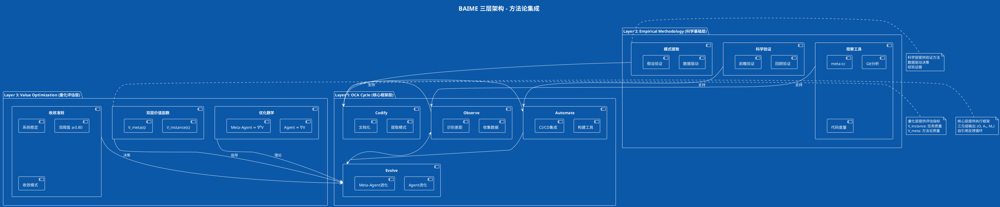

# BAIME 方法论可视化指南

## 什么是 BAIME?

**BAIME (Bootstrapped AI Methodology Engineering)** 是一个统一框架，通过系统化的观察-编码-自动化循环和双层价值函数来开发和验证软件工程方法论。

### 核心创新

1. **双层优化**: 同时优化任务质量（V_instance）和方法论质量（V_meta）
2. **AI-Agent 协调**: Agent 作为梯度，Meta-Agent 作为 Hessian
3. **自引用反馈**: 方法论应用于自身改进
4. **经验验证**: 8个实验，100%成功率，平均4.9次迭代

### 三层架构

BAIME 整合了三个互补的方法论层次：

- **Layer 1: OCA Cycle** - Observe → Codify → Automate → Evolve
- **Layer 2: Empirical Methodology** - 科学方法和数据驱动
- **Layer 3: Value Optimization** - 双层价值函数和收敛数学

---

## 可视化图表

### 1. BAIME 核心迭代循环

这是项目中已有的核心流程图（`docs/methodology/baime_methodology_diagram.puml`），展示了完整的迭代循环。

**关键要素**:
- 双目标：Instance Objectives (完成任务T) + Meta Objectives (改进方法论)
- 初始系统：Meta-Agent Set (M₀) 管理 Agent Set (A₀)
- 迭代阶段：Observe → Plan → Execute → Reflect → Evolve
- 收敛准则：系统稳定 + 双阈值

### 2. 三层架构集成

展示 BAIME 如何整合三个方法论层次：



### 3. 双层价值函数详解

展示 V_instance 和 V_meta 的组成和关系：

```plantuml
@startuml
!theme amiga
title BAIME 双层价值函数

package "V_total(s) = V_instance(s) + V_meta(s)" {

  package "V_instance(s) - 任务质量" #LightBlue {
    card "领域特定组件\n(因项目而异)" as VI {
      rectangle "测试策略示例" as TEST {
        * 代码覆盖率: 0.30
        * 测试质量: 0.30
        * 稳定性: 0.20
        * 性能: 0.20
      }

      rectangle "可观测性示例" as OBS {
        * 覆盖范围: 0.25
        * 可操作性: 0.25
        * 性能: 0.25
        * 一致性: 0.25
      }

      rectangle "依赖健康示例" as DEP {
        * 安全性: 0.40
        * 新鲜度: 0.30
        * 许可证: 0.15
        * 稳定性: 0.15
      }
    }

    note bottom of VI
      目标: V_instance ≥ 0.80
      含义: 任务完成得很好
      验证: 项目特定指标
    end note
  }

  package "V_meta(s) - 方法论质量" #LightGreen {
    card "通用组件\n(跨项目一致)" as VM {
      rectangle "标准评估" as STD {
        * 完整性 (0.25)
          - 方法论文档齐全
        * 有效性 (0.25)
          - 提效倍数
        * 可复用性 (0.25)
          - 跨项目可转移性
        * 验证性 (0.25)
          - 经验证据
      }
    }

    note bottom of VM
      目标: V_meta ≥ 0.80
      含义: 方法论可复用
      验证: 跨项目测试
    end note
  }
}

VI -down[hidden]-> VM

note as N1
  **双层优化创造复合价值**

  不仅完成任务 (V_instance)
  还产出可复用方法 (V_meta)

  **收敛模式**:
  1. 标准双收敛: 两者都 ≥ 0.80
  2. 元聚焦收敛: V_meta ≥ 0.80, V_instance ≥ 0.55
  3. 实用收敛: 质量超过指标
end note

@enduml
```

### 4. Agent-Meta-Agent 关系（优化视角）

展示 Agent 和 Meta-Agent 与优化理论的类比：

```plantuml
@startuml
!theme amiga
title BAIME Agent系统 - 优化理论视角

!define AGENT_COLOR #FFE5B4
!define META_COLOR #E6F3FF
!define VALUE_COLOR #E8F5E9

package "价值空间 S" as VS {
  component "项目状态 s ∈ S" as STATE {
    [代码]
    [测试]
    [文档]
    [架构]
    [依赖]
    [指标]
  }

  note right of STATE
    高维空间
    |S| ≈ 10^1000+
  end note
}

package "价值函数 V: S → ℝ" as VF {
  rectangle "V(s) = V_instance(s) + V_meta(s)" as VFUNC VALUE_COLOR

  note right of VFUNC
    ∂V/∂s 存在 (可微)
    局部最大值
    无全局最大值
  end note
}

package "Agent Set Aₙ" as AGENTS {
  component "Agent A ≈ ∇V(s)" as AGENT AGENT_COLOR {
    rectangle "一阶优化器" as FIRST {
      * coder: ∂V/∂code
      * tester: ∂V/∂tests
      * doc-writer: ∂V/∂docs
      * 领域特化Agent
    }

    note bottom of FIRST
      A(s) 指向更高价值
      |A(s)| 表示改进潜力

      更新规则:
      s_{i+1} = s_i + α·A(s_i)
    end note
  }
}

package "Meta-Agent Set Mₙ" as META {
  component "Meta-Agent M ≈ ∇²V(s)" as MAGENT META_COLOR {
    rectangle "二阶优化器" as SECOND {
      **能力**
      * observe: 分析当前状态 s
      * plan: 选择最优 Agent A*
      * execute: 应用 Agent
      * reflect: 计算 V(s_{i+1})
      * evolve: 创建新Agent
    }

    note bottom of SECOND
      M 选择最优 Agent
      M 估计收敛率
      M 适应局部拓扑

      Agent选择:
      A* = argmax_A [V(s + α·A(s))]
    end note
  }
}

STATE -right-> VFUNC : 评估
VFUNC -down-> AGENT : 计算梯度
VFUNC -down-> MAGENT : 计算曲率
MAGENT -down-> AGENT : 协调/选择
AGENT -left-> STATE : 转换\ns_i → s_{i+1}

note as N1
  **优化类比**

  传统ML          BAIME
  ─────────────   ──────────────
  损失函数 L(θ)   价值函数 V(s)
  参数 θ          项目状态 s
  梯度 ∇L(θ)      Agent A(s)
  SGD优化器       Meta-Agent M
  训练数据        项目历史
  收敛            V(s) ≥ 阈值
  学习模型        (O, Aₙ, Mₙ)
end note

@enduml
```

### 5. OCA循环详细流程

展示 Observe-Codify-Automate 循环的详细阶段：

```plantuml
@startuml
!theme amiga
title BAIME OCA循环 - 详细执行流程

skinparam activity {
  BackgroundColor<<Observe>> #E3F2FD
  BackgroundColor<<Codify>> #FFF3E0
  BackgroundColor<<Automate>> #E8F5E9
  BackgroundColor<<Evaluate>> #F3E5F5
}

start

partition "Phase 1: OBSERVE (观察)" <<Observe>> {
  :使用观察工具收集数据;
  note right
    **工具**:
    • meta-cc 会话分析
    • Git 提交分析
    • 代码指标收集
    • 访问模式跟踪
  end note

  :识别模式和差距;
  note right
    **输出**:
    • 基线度量
    • 瓶颈识别
    • 机会发现
  end note
}

partition "Phase 2: CODIFY (编码)" <<Codify>> {
  :从数据中提取模式;
  note right
    **活动**:
    • 模式识别
    • 假设形成
  end note

  :文档化方法论;
  note right
    **产出**:
    • 模式文档
    • 原则定义
    • 模板创建
  end note

  :验证方法论;
  note right
    **方式**:
    • 真实场景测试
    • 同行评审
  end note
}

partition "Phase 3: AUTOMATE (自动化)" <<Automate>> {
  :设计自动化;
  note right
    **层次**:
    1. 检测: 识别模式
    2. 验证: 检查合规
    3. 执行: 阻止违规
    4. 建议: 自动修复
  end note

  :实现工具;
  note right
    **类型**:
    • 脚本 (bash, Python)
    • CI/CD 集成
    • Linter/Checker
  end note

  :部署和监控;
}

partition "Phase 4: EVALUATE (评估)" <<Evaluate>> {
  :计算 V_instance(s_n);
  note right
    领域特定质量
  end note

  :计算 V_meta(s_n);
  note right
    方法论质量
  end note

  if (收敛检查?) then (是)
    :生成 (O, Aₙ, Mₙ);
    stop
  else (否)
    partition "Phase 5: EVOLVE (进化)" {
      :分析差距;

      if (需要Agent进化?) then (是)
        :创建/更新 Agent;
        note right
          A_{i} → A_{i+1}
          特化Agent出现
        end note
      endif

      if (需要Meta-Agent进化?) then (是)
        :更新 Meta-Agent 能力;
        note right
          M_{i} → M_{i+1}
          (罕见: 8个实验中0次)
        end note
      endif

      :准备下一次迭代;
    }
  endif
}

backward: 下一次迭代;
note right
  **收敛准则**:
  1. 系统稳定: Mₙ = Mₙ₋₁, Aₙ = Aₙ₋₁
  2. 双阈值: V_instance ≥ 0.80 AND V_meta ≥ 0.80
  3. 目标完成
  4. 收益递减: ΔV < 0.02
end note

@enduml
```

### 6. 自引用反馈循环

展示 BAIME 如何应用于自身改进：

```plantuml
@startuml
!theme amiga
title BAIME 自引用反馈循环

skinparam card {
  BackgroundColor<<Layer0>> #FFEBEE
  BackgroundColor<<Layer1>> #FFF3E0
  BackgroundColor<<Layer2>> #E8F5E9
  BackgroundColor<<Layer3>> #E1F5FE
  BackgroundColor<<Layer4>> #F3E5F5
  BackgroundColor<<Layer5>> #FCE4EC
}

card "Layer 0: 基本功能" <<Layer0>> {
  * 构建工具 (meta-cc CLI)
  * 基本查询能力
}

card "Layer 1: 自我观察" <<Layer1>> {
  * 使用工具分析自身会话
  * 发现: 使用模式、瓶颈
  * 数据: 423次文件访问
}

card "Layer 2: 模式识别" <<Layer2>> {
  * 分析数据 (R/E比率, 访问密度)
  * 发现: 文档角色, 优化机会
  * 洞察: plan.md 访问最多 (Entry Point角色)
}

card "Layer 3: 方法论提取" <<Layer3>> {
  * 编码模式
  * 定义: 基于角色的文档方法论
  * 文档: role-based-documentation.md
}

card "Layer 4: 工具自动化" <<Layer4>> {
  * 实现检查 (/meta doc-health)
  * 自动验证: 方法论合规性
  * CI/CD: 文档质量门禁
}

card "Layer 5: 持续进化" <<Layer5>> {
  * 将工具应用于自身
  * 发现新模式 → 更新方法论 → 更新工具
  * 结果: README 1909→275行 (-85%)
}

"Layer 0: 基本功能" -down-> "Layer 1: 自我观察" : 使用
"Layer 1: 自我观察" -down-> "Layer 2: 模式识别" : 分析
"Layer 2: 模式识别" -down-> "Layer 3: 方法论提取" : 编码
"Layer 3: 方法论提取" -down-> "Layer 4: 工具自动化" : 实现
"Layer 4: 工具自动化" -down-> "Layer 5: 持续进化" : 应用

"Layer 5: 持续进化" -up-> "Layer 1: 自我观察" : 闭环反馈

note right of "Layer 5: 持续进化"
  **自引用特性**

  工具改进工具
  方法优化方法

  这创造了闭环:
  每次迭代都改进
  整个系统
end note

@enduml
```

### 7. 收敛模式分类

展示三种经过验证的收敛模式：

```plantuml
@startuml
!theme amiga
title BAIME 收敛模式分类

package "收敛模式" {

  card "标准双收敛\n(Standard Dual Convergence)" as SDC #E8F5E9 {
    rectangle "准则" {
      * V_instance ≥ 0.80
      * V_meta ≥ 0.80
      * Mₙ = Mₙ₋₁
      * Aₙ = Aₙ₋₁
      * ΔV < 0.02
    }

    rectangle "适用场景" {
      * 两个目标同等重要
      * 实例和方法论都需要
    }

    rectangle "验证案例" {
      * 可观测性 (Bootstrap-009)
      * 依赖健康 (Bootstrap-010)
      * 技术债务 (Bootstrap-012)
      * 横切关注点 (Bootstrap-013)
    }
  }

  card "元聚焦收敛\n(Meta-Focused Convergence)" as MFC #E1F5FE {
    rectangle "准则" {
      * V_meta ≥ 0.80
      * V_instance ≥ 0.55 (实用充分)
      * Mₙ = Mₙ₋₁
      * Aₙ = Aₙ₋₁
      * 稳定 ≥2 次迭代
    }

    rectangle "适用场景" {
      * 方法论是主要目标
      * 实例是方法论的载体
      * 实例差距是基础设施非方法论
    }

    rectangle "验证案例" {
      * 知识转移 (Bootstrap-011)
        V_meta = 0.877
        V_instance = 0.585
        95%+ 可转移性
    }
  }

  card "实用收敛\n(Practical Convergence)" as PC #FFF3E0 {
    rectangle "准则" {
      * V_instance + V_meta ≥ 1.60
      * 质量证据超过原始指标
      * 合理的部分准则
      * ΔV < 0.02
    }

    rectangle "适用场景" {
      * 某些组件未达标但整体质量优秀
      * 子系统卓越补偿聚合指标
      * 进一步迭代收益递减
    }

    rectangle "验证案例" {
      * 测试策略 (Bootstrap-002)
        V_instance = 0.848
        核心包覆盖率 86-94%
        15x 提效已验证
    }
  }
}

note bottom of SDC
  **最常见**: 6/8 实验
  **特点**: 两层都完全达标
end note

note bottom of MFC
  **稀有**: 1/8 实验
  **特点**: 方法论优秀, 实例充分
  **权衡**: 接受实例不完美换取方法论可转移性
end note

note bottom of PC
  **中等**: 1/8 实验
  **特点**: 质量超过指标
  **依据**: Bootstrap-002 建立先例
end note

@enduml
```

### 8. 验证结果总览

展示 8 个实验的验证数据：

```plantuml
@startuml
!theme amiga
title BAIME 验证结果 - 8个实验总览

skinparam card {
  BackgroundColor<<Fast>> #E8F5E9
  BackgroundColor<<Medium>> #FFF3E0
  BackgroundColor<<Complex>> #FFEBEE
}

together {
  card "简单域 (3-4次迭代)" <<Fast>> {
    **依赖健康 (Bootstrap-010)**
    * 迭代: 3
    * V_instance: 0.92
    * V_meta: 0.85
    * 提效: 6x (9h→1.5h)
    * 可转移性: 88%

    **知识转移 (Bootstrap-011)**
    * 迭代: 3-4
    * V_instance: 0.585
    * V_meta: 0.877
    * 提效: 3-8x
    * 可转移性: 95%+
    ---
    特点: 快速收敛
  }

  card "中等域 (4-6次迭代)" <<Medium>> {
    **文档系统 (Bootstrap-001)**
    * 迭代: 3
    * Token成本: -47%
    * 可转移性: 85%

    **测试策略 (Bootstrap-002)**
    * 迭代: 5
    * V_instance: 0.848
    * 覆盖率: 75%→86%
    * 提效: 15x
    * 可转移性: 89%

    **可观测性 (Bootstrap-009)**
    * 迭代: 6
    * V_instance: 0.87
    * V_meta: 0.83
    * 提效: 23-46x
    * 可转移性: 90-95%
    ---
    特点: 平衡优化
  }

  card "复杂域 (6-8次迭代)" <<Complex>> {
    **错误恢复 (Bootstrap-003)**
    * 迭代: 5
    * 错误分类: 95.4%覆盖
    * 可转移性: 85%

    **技术债务 (Bootstrap-012)**
    * 迭代: 4
    * V_instance: 0.805
    * V_meta: 0.855
    * SQALE量化
    * 可转移性: 85%

    **横切关注点 (Bootstrap-013)**
    * 迭代: 8
    * 最大单次增益: +27.3%
    * ROI: 16.7x
    * 可转移性: 70-80%
    ---
    特点: 高价值复杂优化
  }
}

note bottom
  **整体统计**
  • 成功率: 100% (8/8)
  • 平均迭代: 4.9
  • 平均时长: 9.1小时
  • V_instance 平均: 0.784
  • V_meta 平均: 0.840
  • 可转移性: 70-95%
  • 提效: 3-46x
end note

@enduml
```

---

## 使用指南

### 如何生成这些图表

1. **安装 PlantUML**:
   ```bash
   # Ubuntu/Debian
   sudo apt install plantuml

   # macOS
   brew install plantuml

   # 或使用在线工具
   # https://www.plantuml.com/plantuml/
   ```

2. **生成 PNG 图像**:
   ```bash
   # 生成单个图表
   plantuml baime-visualization.md

   # 生成所有图表
   plantuml docs/methodology/*.puml
   ```

3. **在文档中使用**:
   - 将生成的 PNG 嵌入到 Markdown
   - 或直接使用 PlantUML 代码块（GitHub/GitLab 支持）

### 图表选择指南

- **介绍 BAIME**: 使用图表 1 (核心迭代循环)
- **解释架构**: 使用图表 2 (三层架构集成)
- **说明价值函数**: 使用图表 3 (双层价值函数)
- **优化理论**: 使用图表 4 (Agent-Meta-Agent 关系)
- **执行流程**: 使用图表 5 (OCA 循环详细流程)
- **自引用特性**: 使用图表 6 (自引用反馈循环)
- **收敛模式**: 使用图表 7 (收敛模式分类)
- **验证结果**: 使用图表 8 (验证结果总览)

### 定制建议

如需针对特定领域定制图表：

1. **测试策略**: 修改图表 3，使用测试相关的 V_instance 组件
2. **CI/CD**: 修改图表 5，添加 CI/CD 特定阶段
3. **文档系统**: 修改图表 6，使用文档优化案例

---

## 参考资料

- **核心文档**: `.claude/skills/methodology-bootstrapping/SKILL.md`
- **价值优化**: `.claude/skills/methodology-bootstrapping/reference/dual-value-functions.md`
- **OCA 循环**: `.claude/skills/methodology-bootstrapping/reference/observe-codify-automate.md`
- **验证案例**: `experiments/bootstrap-*/` (8 个实验)
- **已有图表**: `docs/methodology/baime_methodology_diagram.puml`

---

**版本**: 1.0.0
**最后更新**: 2025-12-13
**状态**: ✅ 生产就绪
